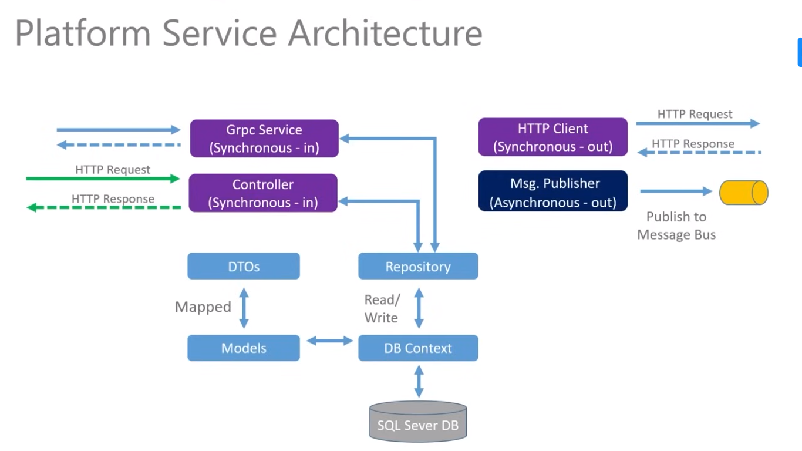

# Microservices Project with .NET

This repository contains the source code and materials for a microservices project built with the help of the "Building Microservices with .NET" tutorial available on [YouTube](https://www.youtube.com/watch?v=DgVjEo3OGBI&ab_channel=LesJackson). The tutorial served as a valuable guide throughout the development process.

## Table of Contents
- [Introduction](#introduction)
- [Project Overview](#project-overview)
- [Project Structure](#project-structure)
- [Microservices Implementation](#microservices-implementation)
- [Docker & Kubernetes Deployment](#docker--kubernetes-deployment)
- [Additional Services](#additional-services)
- [SQL Server Integration](#sql-server-integration)
- [Multi-Resource API](#multi-resource-api)
- [Message Bus & RabbitMQ](#message-bus--rabbitmq)
- [Asynchronous Messaging](#asynchronous-messaging)
- [gRPC Integration](#grpc-integration)
- [Acknowledgments](#acknowledgments)

## Introduction
This project entails the construction of microservices with .NET, encompassing various aspects of microservices development, ranging from project initiation to the deployment of microservices on a Kubernetes cluster.

## Project Overview
The project is a practical implementation of microservice architecture that includes two .NET microservices developed using the REST API pattern, dedicated persistence layers for both services, deployment to a Kubernetes cluster, API Gateway pattern implementation, synchronous messaging using HTTP and gRPC, and asynchronous messaging with RabbitMQ.

## Project Structure
Explore the organization and structure of the project, understanding how different components interact to deliver a fully functional microservices architecture.

  

  

  

  

## Docker & Kubernetes Deployment
The project extensively uses Docker for containerization, and Kubernetes for orchestrating the deployment of microservices to a cluster.

## Additional Services
Beyond the core microservices, the project explores additional services such as API Gateway pattern implementation and synchronous messaging between services.

## SQL Server Integration
SQL Server is seamlessly integrated into the microservices architecture, and Kubernetes is configured to manage database operations.

## Multi-Resource API
A multi-resource API is developed, covering data layer models, repositories, and controllers to enhance the functionality of the microservices.

## Message Bus & RabbitMQ
The importance of message buses, specifically RabbitMQ, is demonstrated in the project. RabbitMQ is deployed to Kubernetes to enable asynchronous messaging.

## Asynchronous Messaging
Asynchronous messaging is implemented using an Event Bus, with a detailed walkthrough of adding a message bus publisher, event processing, and listeners.

## gRPC Integration
The project dives into gRPC, including networking configuration, package references, and practical implementation in microservices for efficient communication.

## Acknowledgments
Special thanks to the creator of the tutorial [Les Jackson](https://www.youtube.com/watch?v=DgVjEo3OGBI&ab_channel=LesJackson) for providing an insightful and educational resource. The tutorial has been instrumental in the successful completion of this microservices project.

**Note:** This project is licensed under the MIT License - see the [LICENSE](./LICENSE) file for details.
